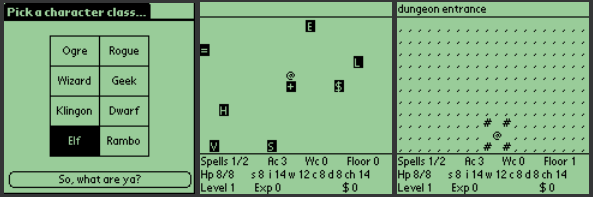

# iLarn

[iLarn](http://roguelike-palm.sourceforge.net/iLarn/index.php) is a game for the
[PalmPilot](http://www.palm.com/) (or other handheld computer that runs the Palm
OS). It is open-source freeware available under the GPL. It is derived from
Ularn, also known as Ultra-Larn. Ularn, by Phil Cordier, is a ["rogue-like"
game](http://roguelikes.sauceforge.net/pub/index.html). These games are
text-based and have a familiar premise: wander around in a dungeon, collect
treasure, deal with bad-tempered monsters, try to finish a quest. Ularn has been
around since 1989 or so and is based on an older (1986) game, Larn, by Noah
Morgan.

## Note from the repo owner

I've made this repo purely as a preservation method for myself. I have not
created, nor edited any of the code from where it was previously stored. I
originally found it on a Sourceforge CVS repository, which has been sitting
around coming up on 20 years. I want to read through the code more accessibly,
so I put it here. All credit goes to the original authors. In fact, most of this
readme is verbatim from the [iLarn
website](http://roguelike-palm.sourceforge.net/iLarn/index.php)

## How does this game differ from iRogue?

If you have never played Ularn, here are some ways that it is different from
Rogue.

You never get hungry, but instead your quest has a time limit (number of moves).

You can't throw things, but you can learn and cast spells.

In addition to "strength" you have the other familiar "intelligence, wisdom,
dexterity, constitution, charisma" attributes. There are several character
classes to choose from, which will determine the initial values of your
attributes.

There is a town with shops and a bank and a college. The shops have fixed
prices. Your bank account is interest-bearing. Taking a college course can raise
one of your attributes.

The dungeon levels are less like a collection of rooms and more like a maze.

Ularn/iLarn 'remembers' the dungeon levels you have been to. If you enter the
dungeon, explore some of level 1, then return to the town, when you re-enter the
dungeon you will find level 1 just as you have left it.. (except that a few more
monsters might have moved in while you were gone). This means that when you have
a game in progress, iLarn will tend to take up more space.
